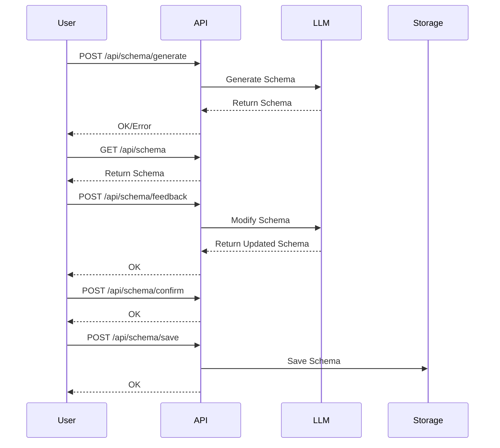

# Schema Generation Workflow Documentation

## Overview
This document describes the API endpoints and workflow for generating and managing graph schemas.

## Workflow Steps
1. **Schema Generation**
   - Accepts multiple file paths
   - Parses files and samples data
   - Calls LLM to generate initial schema

2. **Schema Retrieval**
   - Returns current schema in JSON format

3. **Schema Feedback**
   - Accepts user feedback on schema
   - Modifies schema based on feedback

4. **Schema Confirmation**
   - Marks schema as finalized

5. **Schema Saving**
   - Saves confirmed schema to specified path

## Sequence Diagram

## API Endpoints

### POST /api/schema/generate
- **Purpose**: Generate initial schema
- **Input**: List of file paths
- **Response**: Status (OK/Error)

### GET /api/schema
- **Purpose**: Retrieve current schema
- **Response**: Schema in JSON format

### POST /api/schema/feedback
- **Purpose**: Provide schema feedback
- **Input**: Feedback and modification instructions
- **Response**: Status (OK)

### POST /api/schema/confirm
- **Purpose**: Confirm final schema
- **Response**: Status (OK)

### POST /api/schema/save
- **Purpose**: Save confirmed schema
- **Input**: Destination path
- **Response**: Status (OK)
